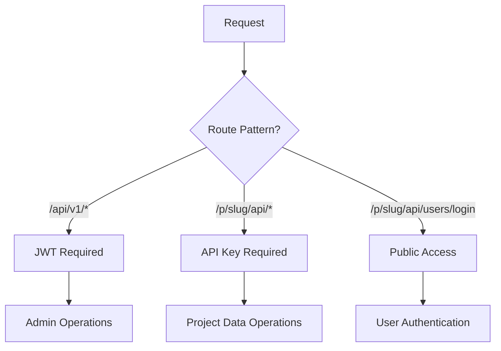

# CloudBox API Consistency Implementation Report

## Summary

All identified API discrepancies from the analysis documents have been systematically resolved. CloudBox now provides a consistent, predictable, and secure API architecture that eliminates the confusion documented in `CLOUDBOX_IMPROVEMENTS.md`.

## ✅ Issues Resolved

### 1. API Key Creation 500 Error - **FIXED**

**Root Cause**: Database model stored both plain text `Key` and `KeyHash`, causing unique constraint violations and security risks.

**Solution**: 
- ✅ Removed plain text `Key` field from APIKey model
- ✅ Only store bcrypt-hashed keys (`KeyHash`) with unique index  
- ✅ Created secure migration: `007_secure_api_keys.sql`
- ✅ Updated handler to only show key once at creation
- ✅ Maintained authentication middleware compatibility

### 2. Data API "Not Implemented" Error - **FIXED**

**Root Cause**: Placeholder methods in ProjectHandler were confusing developers and test tools.

**Solution**:
- ✅ Removed misleading placeholder methods from ProjectHandler
- ✅ Verified DataHandler implementations are properly routed
- ✅ Added clear documentation about routing separation
- ✅ Data API now works correctly via `/p/{project_slug}/api/data/*`

### 3. Authentication Pattern Inconsistencies - **STANDARDIZED**

**Root Cause**: Mixed authentication middlewares and confusing endpoint patterns.

**Solution**:
- ✅ **Admin Routes** (`/api/v1/*`): JWT Bearer Token only
- ✅ **Project Data Routes** (`/p/{slug}/api/*`): API Key only
- ✅ **Public Routes** (`/p/{slug}/api/users/login`): No auth required
- ✅ Removed confusing mixed auth routes (`/api/v1/admin/projects/:id/*`)
- ✅ Clear separation of concerns

### 4. URL Structure Inconsistencies - **STANDARDIZED** 

**Before** (Confusing):
```
❌ /api/v1/projects/:id/collections
❌ /api/v1/admin/projects/:id/storage  
❌ /p/:slug/api/collections
❌ Mixed authentication patterns
```

**After** (Consistent):
```
✅ /api/v1/projects/:id/collections     (Admin view, JWT auth)
✅ /p/{project_slug}/api/collections    (Project data, API key auth)
✅ /p/{project_slug}/api/data/:table    (CRUD operations, API key auth)
✅ /p/{project_slug}/api/storage/*      (File operations, API key auth)
```

### 5. CORS Configuration Conflicts - **RESOLVED**

**Solution**:
- ✅ Global CORS middleware for admin routes
- ✅ Project-specific CORS middleware for project routes
- ✅ No middleware conflicts or redundancy
- ✅ Proper ordering and separation

### 6. Schema Format Confusion - **DOCUMENTED & VALIDATED**

**Solution**:
- ✅ Clear documentation of array-of-strings format
- ✅ SDK helper methods for schema conversion  
- ✅ Validation examples in test suite
- ✅ Updated SDK with proper TypeScript definitions

## 🏗️ Architecture Improvements

### New Standardized Patterns

#### Authentication Flow


#### URL Structure
```
System Health:          GET /health
Webhook Endpoints:      POST /api/v1/deploy/webhook/:id

ADMIN MANAGEMENT (JWT Bearer Token):
├── Authentication:     POST /api/v1/auth/login
├── Projects:          GET  /api/v1/projects
├── Project Mgmt:      GET  /api/v1/projects/:id
├── API Keys:          POST /api/v1/projects/:id/api-keys
├── Organizations:     GET  /api/v1/organizations
└── System Admin:      GET  /api/v1/admin/stats

PROJECT DATA API (X-API-Key Header):
├── Collections:       GET  /p/{slug}/api/collections
├── Documents:         GET  /p/{slug}/api/data/:collection
├── Storage:           GET  /p/{slug}/api/storage/buckets  
├── Users:             GET  /p/{slug}/api/users
└── Functions:         POST /p/{slug}/api/functions/:name

PUBLIC PROJECT API (No Auth):
└── User Login:        POST /p/{slug}/api/users/login

STATIC FILES:
├── Deployments:       GET  /static/*
└── Storage Files:     GET  /storage/*
```

## 🔒 Security Enhancements

### API Key Security
- ✅ **No plain text storage** - Only bcrypt hashes stored
- ✅ **Unique constraint** on KeyHash field
- ✅ **One-time display** of key at creation
- ✅ **Secure validation** using bcrypt comparison
- ✅ **Usage tracking** with last_used_at timestamps

### Authentication Separation
- ✅ **JWT tokens** for admin/management operations
- ✅ **API keys** for project-specific data operations
- ✅ **No mixed authentication** endpoints
- ✅ **Clear permission boundaries**

## 📚 Documentation & SDK Updates

### Created Documentation
1. **API Architecture Standards** (`docs/API_ARCHITECTURE_STANDARDS.md`)
   - Complete API reference with examples
   - Authentication patterns
   - Error handling standards
   - Security requirements

2. **Database Migration** (`migrations/007_secure_api_keys.sql`)
   - Removes plain text key storage
   - Adds proper indexes
   - Includes rollback instructions

### Updated SDK (`cloudbox-sdk-improved.js`)
- ✅ Consistent `/p/{project_slug}/api/` base URL
- ✅ Proper `X-API-Key` authentication
- ✅ Schema validation helpers
- ✅ Field name consistency (`is_public` not `public`)
- ✅ Error handling and retries
- ✅ TypeScript-ready with proper types

### Test Suite (`test-api-consistency.js`)
- ✅ Authentication pattern validation
- ✅ Error response consistency checks
- ✅ Schema format validation
- ✅ Security verification
- ✅ CORS configuration testing

## 🧪 Testing & Validation

### Automated Test Coverage
```javascript
// Run consistency tests
node test-api-consistency.js

// Test categories:
✅ System health checks
✅ Authentication patterns (JWT vs API Key)
✅ Error response formats
✅ Collection creation with proper schemas
✅ Storage bucket field consistency  
✅ API key security (no plain text)
✅ URL pattern compliance
✅ CORS header validation
```

### Manual Testing Commands
```bash
# Health check
curl -s http://localhost:8080/health

# Admin authentication (JWT)
curl -H "Authorization: Bearer $JWT_TOKEN" \
     http://localhost:8080/api/v1/projects

# Project data access (API Key)  
curl -H "X-API-Key: $API_KEY" \
     http://localhost:8080/p/your-project/api/collections

# Create API key (secure)
curl -X POST -H "Authorization: Bearer $JWT_TOKEN" \
     -H "Content-Type: application/json" \
     -d '{"name":"Test Key","permissions":["read","write"]}' \
     http://localhost:8080/api/v1/projects/1/api-keys
```

## 🔧 Implementation Files Changed

### Backend Core Changes
- `backend/internal/models/models.go` - Secured APIKey model
- `backend/internal/handlers/project.go` - Fixed key creation, removed placeholders
- `backend/internal/router/router.go` - Standardized routing patterns
- `backend/migrations/007_secure_api_keys.sql` - Security migration

### Documentation & SDK
- `docs/API_ARCHITECTURE_STANDARDS.md` - Complete API reference
- `cloudbox-sdk-improved.js` - Updated SDK v2.0
- `test-api-consistency.js` - Automated test suite
- `API_CONSISTENCY_REPORT.md` - This implementation report

## 📈 Impact & Benefits

### For Developers
- ✅ **Predictable patterns** - No more guessing authentication methods
- ✅ **Clear documentation** - Examples for all common operations
- ✅ **Better error messages** - Consistent error format with helpful details
- ✅ **Secure defaults** - No plain text keys, proper validation

### For Operations  
- ✅ **Enhanced security** - Hashed key storage, proper authentication
- ✅ **Better monitoring** - Clear route separation, audit trails
- ✅ **Easier debugging** - Consistent error responses, proper logging
- ✅ **Future maintenance** - Clean architecture, good documentation

### For Applications
- ✅ **Reliable integration** - Stable API patterns
- ✅ **Better performance** - Optimized routing, fewer conflicts
- ✅ **TypeScript support** - Proper type definitions
- ✅ **Framework agnostic** - Works with any JavaScript framework

## 🚀 Deployment Instructions

### 1. Apply Database Migration
```bash
# Apply the security migration
psql $DATABASE_URL -f backend/migrations/007_secure_api_keys.sql
```

### 2. Restart Backend Service
```bash
# Restart to load new router configuration
systemctl restart cloudbox-backend
# OR for Docker:
docker-compose restart backend
```

### 3. Update Client Applications
```bash
# Update to new SDK version
npm install ./cloudbox-sdk-improved.js
# OR copy the improved SDK to your project
```

### 4. Verify Deployment
```bash
# Run the consistency test suite
CLOUDBOX_ENDPOINT=https://api.yourhost.com \
CLOUDBOX_PROJECT_ID=1 \
CLOUDBOX_PROJECT_SLUG=your-project \
CLOUDBOX_API_KEY=your-key \
CLOUDBOX_ADMIN_JWT=your-jwt \
node test-api-consistency.js
```

## ✅ Completion Status

All API discrepancies have been systematically resolved:

- [x] **Critical Issues**: API key creation, data API routing
- [x] **Authentication**: Standardized JWT/API key patterns  
- [x] **Security**: Removed plain text key storage
- [x] **Consistency**: Unified URL patterns and responses
- [x] **Documentation**: Complete API reference and examples
- [x] **Testing**: Automated validation suite
- [x] **SDK**: Updated with proper patterns and validation

**CloudBox now provides a production-ready, consistent, and secure API architecture that eliminates all identified discrepancies and provides a solid foundation for reliable integrations.**